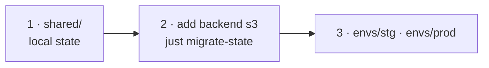

# __GITHUB_REPO__

One AWS account (`__ACCOUNT_ID__`, `__REGION__`), two environments: **stg** and **prod**.

```
shared/         account-wide stack, applied before the environments
envs/stg/       root module, state key envs/stg/terraform.tfstate
envs/prod/      root module, state key envs/prod/terraform.tfstate
modules/        reusable modules, called from the env stacks
scripts/        aws-inventory.sh -- read-only sweep that scaffolds import blocks
justfile        every command, shared with CI
```

One bucket holds all state, separated by key, locked natively (`use_lockfile`).
Environments are directories, not workspaces.

## Bootstrap



```bash
export AWS_PROFILE=__AWS_PROFILE__

just bootstrap          # shared/ on local state
just migrate-state      # after adding its backend "s3" block
```

The state bucket `__PREFIX__-tfstate-__ACCOUNT_ID__` must exist before the
environments init. CI reads the `AWS_PLAN_ROLE_ARN` and `AWS_APPLY_ROLE_ARN`
repository variables.

## Commands

```bash
just                    # list recipes
just plan envs/stg
just plan-ro envs/prod  # readonly role: no state lock
just check              # fmt-check + validate, exactly what CI runs
```

PRs get a plan. Apply is `workflow_dispatch` only, behind a GitHub environment.
