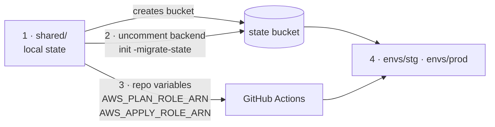
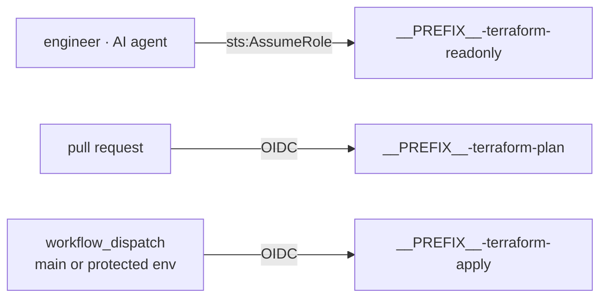

# __GITHUB_REPO__

One AWS account (`__ACCOUNT_ID__`, `__REGION__`), two environments: **stg** and **prod**.

```
shared/         state bucket + GitHub OIDC + the plan/apply/readonly roles
envs/stg/       root module, state key envs/stg/terraform.tfstate
envs/prod/      root module, state key envs/prod/terraform.tfstate
modules/        network · ec2-app-host · rds-mysql · s3-bucket · security-group
scripts/        aws-inventory.sh -- read-only sweep that scaffolds import blocks
justfile        every command, shared with CI
```

One bucket holds all state, separated by key, locked natively (`use_lockfile`).
Environments are directories, not workspaces.

## Bootstrap



```bash
export AWS_PROFILE=__AWS_PROFILE__

just bootstrap
# uncomment the backend block in shared/versions.tf
just migrate-state
just output shared      # -> set the two repository variables
```

## Permissions



## Commands

```bash
just                    # list recipes
just plan envs/stg
just plan-ro envs/prod  # readonly role: no state lock
just check              # fmt-check + validate, exactly what CI runs
```

PRs get a plan. Apply is `workflow_dispatch` only, behind a GitHub environment.
