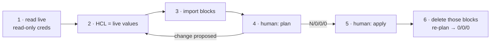

# Adopting existing AWS resources

Contents: [Goal](#goal) · [Workflow](#workflow) · [Ownership](#ownership) ·
[Import blocks](#import-blocks) · [Traps by resource](#traps-by-resource) ·
[Proving it before a plan](#proving-it-before-a-plan)

## Goal

Adoption is **state-only**. A resource is adopted when its first plan reads
`N to import, 0 to add, 0 to change, 0 to destroy`. When the plan proposes a
change, fix the HCL to match live -- never the resource. Improvements (tags,
encryption, narrower IAM) come later, each as its own reviewable change.

`0 to change` is a proxy for "no AWS writes", not a guarantee: see the
Terraform-only attributes under RDS.

## Workflow

1. Read live state with read-only credentials only (`aws ... describe/list/get`,
   or `scripts/aws-inventory.sh`). Never record secret values, user_data, or key
   material while reading.
2. Rewrite placeholder locals to live values first. Greenfield CIDRs in
   `envs/*/main.tf` that do not match live plan as destroy/create.
3. Adopt downward in dependency order: network → security groups → compute /
   databases → load balancers. S3 and IAM have no dependencies.
4. One resource family per change, so each plan stays reviewable.
5. Hand back the expected plan counts. The human runs plan and apply.
6. After an apply, remove exactly the blocks that apply imported, then re-plan.
   A resource can import clean and still show a second-round diff after its
   first apply (post-apply state differs from import state); that second plan
   is the only place it appears.

## Ownership

- **Declared by another tool** (CloudFormation/CDK stack, Elastic Beanstalk,
  GuardDuty-managed security groups, service-linked roles): do not import. Two
  owners fight, and a redeploy of the other tool recreates what it lost.
  Reference those by ID in a `local` map instead. Check with
  `aws cloudformation list-stack-resources` and the `aws:cloudformation:*` tags.
  Retiring a stack means `DeletionPolicy: Retain` on every resource, then
  deleting the stack, then importing: a production write that needs explicit
  approval.
- **Used by one environment** → that `envs/<env>/`. **Account-wide** (IAM
  users, groups, cross-env policies, service roles) → `shared/`.
- **One live object used by several module instances** (a security group or
  instance profile shared by three hosts) cannot live inside a per-host module:
  it would need several addresses for one object. Declare it standalone and
  pass it in with `manage_security_group = false` / `manage_iam = false`.

## Import blocks

- Keep them in `<stack>/imports.tf`, headed with the expected plan counts.
- Iterate the same local as the resource:
  `import { for_each = local.x  to = res.name[each.key]  id = ... }`
  (Terraform >= 1.7). The config and the imports then cannot drift apart.
- Import IDs must be known at plan time: build ARNs from strings, never from
  attributes of resources being imported in the same plan.
- A resource on a provider alias needs `provider = aws.<alias>` in its import
  block. The provider reference is static; it cannot use `each`.
- An import block whose target is already in state is a plan error. Deleting a
  block **before** its apply ran is worse and silent: the plan offers to create
  a duplicate of a running resource. Remove a block only after its own apply.
- Common ID shapes: attachment `<role|user|group>/<policy-arn>`; inline policy
  `<principal>:<policy-name>`; route table association `<subnet-id>/<rtb-id>`;
  default route `<rtb-id>_0.0.0.0/0`; Route 53 record `<zone>_<name>_<type>`.

## Traps by resource

### Everything

- `default_tags` writes tags onto every adopted resource. Comment it out in an
  env stack while it adopts. Where the stack already manages tagged resources
  (e.g. `shared/`), add an untagged provider alias
  (`provider "aws" { alias = "adopted" ... }`) and put adopted resources on it.
- Copy every string verbatim, typos included -- descriptions, Name tags,
  `description = ""` versus absent. Empty-string and unset are different values.
- ForceNew attribute unknown or computed? Pass `null`, never a guess.
- Hand edits made in the console (an extra bucket-policy statement, a tag)
  must be declared, or the plan removes them.

### Network (`modules/network`)

- Live names: `name_overrides`. Live subnets without a Tier tag:
  `tag_subnet_tier = false`.
- `aws_default_security_group` with no rules revokes the default group's rules:
  `manage_default_security_group = false` unless verified unused.
- Each default route is its own `aws_route` and needs its own import, or the
  apply fails `RouteAlreadyExists`.
- An existing flow log's destination and role are ForceNew: keep
  `enable_flow_logs = false` rather than replace a working delivery.
- The module is declared as a unit: import all its resources together.

### Security groups (`modules/security-group`)

- `description` is immutable. A mismatch replaces the group and detaches it
  from everything using it.
- Rules are standalone resources; the map key is the import contract. Renaming
  a key destroys and recreates that rule.
- Untagged rules/groups: `tag_rules = false`, `add_name_tag = false`. A Name tag
  that differs from the group name: `add_name_tag = false` plus
  `tags = { Name = "<live tag>" }`.
- The default egress rule carries `description = "All outbound"`; live rules
  usually have none, so pass `egress_rules = { all = { cidr_ipv4 = "0.0.0.0/0" } }`.

### EC2 (`modules/ec2-app-host`)

- `root_volume_encrypted` is ForceNew: match live (usually `false`).
  Encrypting is a snapshot-and-replace project.
- `disable_api_termination`: match live, or the plan switches protection off.
- `root_volume_delete_on_termination`: match live.
- `associate_public_ip = null` (ForceNew and computed).
- `instance_metadata_tags`, `metadata_hop_limit`, root size/type, key name:
  match live. Root volumes and their untagged state (`tag_root_volume = false`)
  come in with the instance -- never import them separately.
- `user_data` is in `ignore_changes`: changing it stops and starts the host.
  Never copy live user_data into the repo; it often holds credentials.
- Key pairs cannot be imported (AWS does not return the public key); reference
  `key_name` only.
- Adopt an Elastic IP as a plain `aws_eip`, not `assign_eip`: the module writes
  `<name>-eip` and forces `associate_public_ip_address = false`.

### RDS (`modules/rds-mysql`)

- `storage_encrypted` is ForceNew; `manage_master_user_password = true` rotates
  the password into Secrets Manager (connection drop); `publicly_accessible`
  moves the endpoint. Match live on all three.
- Set `deletion_protection` and `prevent_destroy` before importing.
- AWS-owned default subnet/parameter groups cannot be owned: pass their names
  with the `manage_*` knobs off.
- Terraform-only attributes are not read from AWS. Import sets
  `skip_final_snapshot = true` in state, so config must say `true`.
  `apply_immediately` never reaches zero; that one diff is state-only.
- Remove a database from state (`terraform state rm`) before deleting it in
  AWS, or the next plan builds a fresh empty one.

### S3 (`modules/s3-bucket`)

- Each aspect (versioning, encryption, lifecycle, CORS, policy, ownership,
  public access block) is its own resource importing on the bucket name. Adopt
  only aspects that match; switch the rest off with the `manage_*` knobs.
- `aws_s3_bucket_policy` replaces the whole policy. Adopting it with a partial
  document drops grants (e.g. CloudFront OAC) and breaks consumers.

### Load balancers

- Import fills both `target_group_arn` and the nested `forward` block. Config
  must match **post-apply** state: `aws_lb_listener` keeps both forms,
  `aws_lb_listener_rule` keeps `forward` only.
- Listener stickiness duration `0` is valid live but rejected by the schema;
  omit the sub-block and accept a one-time, connection-safe diff.
- Check every rule for tags; they are easy to miss and the apply deletes them.

### IAM

- Policy documents verbatim, as JSON files (`policy = file(...)`), including
  `"Sid": ""` in trust policies.
- Users: adopt identity, attachments, group membership
  (`aws_iam_user_group_membership`, non-exclusive) and inline policies. Access
  keys and login profiles cannot be imported. `ignore_changes = [tags]`: the
  console stores each access key's description as a tag on its user.
- Leave CloudFormation-, CDK- and AWS-service-created roles alone.

## Proving it before a plan

`terraform validate` cannot see any of the traps above. Before handing over:

1. `just check` (fmt + offline validate).
2. Diff the config against the live read as sets (users, attachments, per-host
   fields). For `terraform console` without touching the real backend, copy the
   stack to a scratch directory with `backend_override.tf` =
   `terraform { backend "local" {} }` and `init` there.
3. State the exact expected plan line in the handover.
